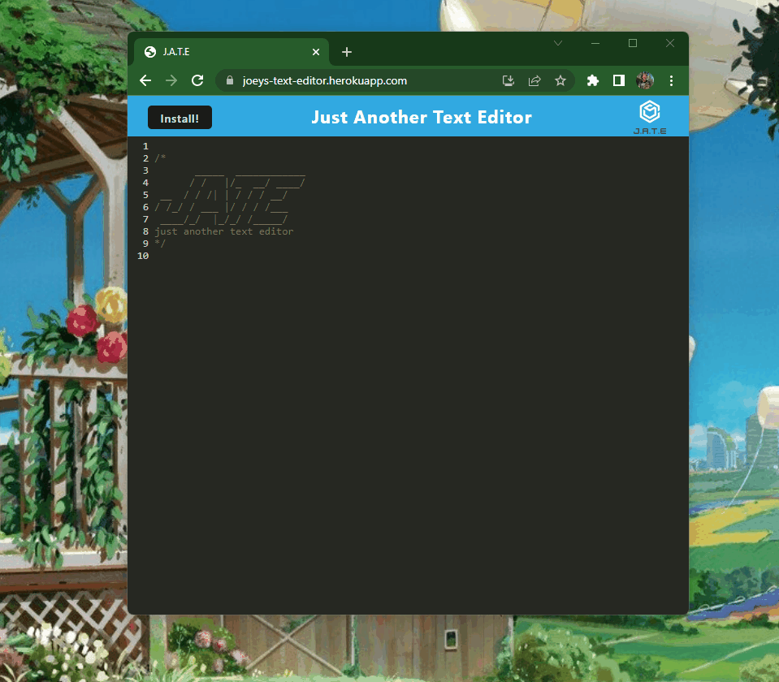

# Text Editor
 

## Description
This is a single-page text editor which stores data to an IndexedDB database. This application features multiple data persistence techniques in case one of the options aren't supported by the browser. This application also functions offline when installed.

## Table of Contents
1. [Installation](#installation)
2. [Usage](#usage)
3. [Technologies Used](#technologies-used)
4. [Credits](#credits)
5. [License](#license)

## Installation
To install this web app, you simply need to visit the deployed site <a href="https://joeys-text-editor.herokuapp.com/" target="_blank">here</a>, then click the install button!

## Usage
To use this app you can start by visiting the deployed site <a href="https://joeys-text-editor.herokuapp.com/" target="_blank">here</a>.

Once you are there you can type into the document anywhere to begin!!

## Technologies Used
* [Webpack](https://www.npmjs.com/package/webpack)
* [Node.js](https://www.npmjs.com/package/webpack)
* [Heroku](heroku.com)
* [IndexedDB](https://www.npmjs.com/package/idb)
* [Express.js](https://expressjs.com/)
* [Concurrently](https://www.npmjs.com/package/concurrently)
* [Babel](https://www.npmjs.com/package/@babel/core)
* [Workbox](https://www.npmjs.com/package/workbox)
* [Nodemon](https://www.npmjs.com/package/nodemon)

## Credits
This application was built by [coderbennett](https://github.com/coderbennett).

## License
This application is under the Apache 2.0 license. Please view the [LICENSE](LICENSE.txt) document for more information.